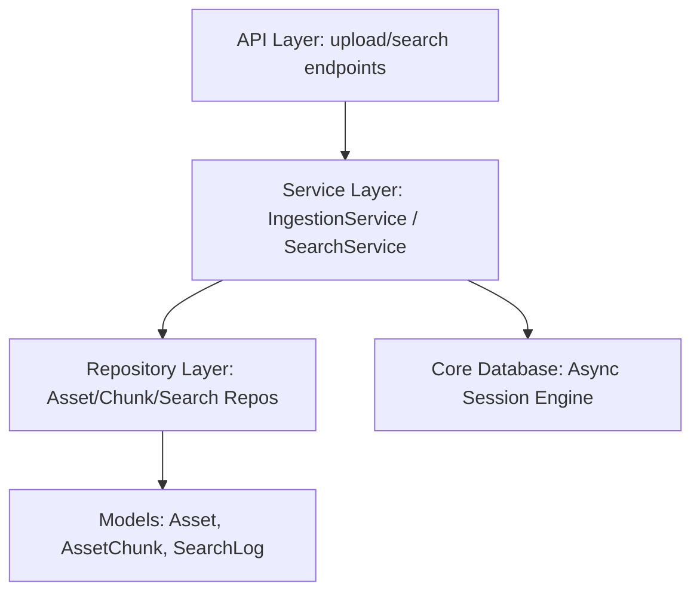

# System Architecture Overview

This document provides a description of the architectural layout and division of concerns within the OMNISEEK backend server.

---

## 1. Clean Architecture Division

The project adheres to Clean Architecture principles, ensuring that data definitions, SQL executions, and web handlers are decoupled. The code structure under `backend/` is split into:

*   **API Layer (`backend/api/`)**: Exposes endpoint routing handles (using FastAPI) and routes incoming payloads. Contains no business validation or database queries. Registered routes:
    *   `/upload`: Synchronously ingests files and runs embedding pipelines.
    *   `/search`: Triggers cross-modal semantic similarity searches.
*   **Service Layer (`backend/services/`)**: Orchestrates business rules. Handles operations across multiple repository boundaries and coordinates transactional executions (commit/rollback) via the database service context. Added services:
    *   `SearchEmbeddingService`: Generates truncated, normalized 512-dim vectors from text queries using BGE-M3.
    *   `SearchAnalyticsService`: Logs search metadata and performance measurements to DB logs.
    *   `SearchService`: Main orchestrator coordinating embeddings generation, repository lookups, score normalization, duplication filtering, chunk aggregation, and analytics logging.
*   **Repository Layer (`backend/repositories/`)**: Provides direct database SQL mapping and data querying utilities. Business logic must not reside in this layer. Added repositories:
    *   `SemanticSearchRepository`: Performs pgvector nearest-neighbor matching using cosine operator class joins.
*   **Model Layer (`backend/models/`)**: Mapped SQLAlchemy entities defining tables and relationships in PostgreSQL. Added models:
    *   `SearchLog`: Represents query logs containing latency, results counts, and timestamps.
*   **Core Configuration (`backend/core/`)**: Setup parameters including environment validation, database connection pooling, async sessions, and root logger configurations.

---

## 2. Component Dependency Relationships

The system dependencies run unidirectionally inwards towards the database models:

Dependency Injection is managed explicitly via FastAPI's `Depends` parameters, yielding scoped database sessions per request hook that are safely committed or rolled back.
