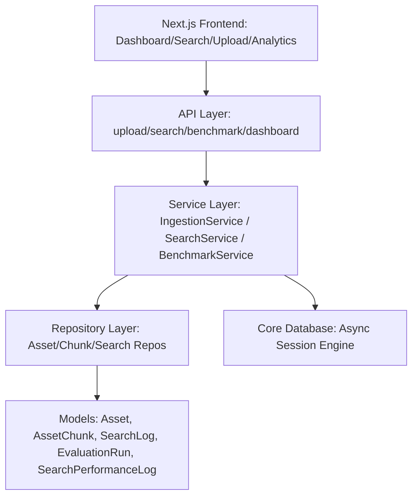

# System Architecture Overview

This document provides a description of the architectural layout and division of concerns within the OMNISEEK system.

---

## 1. Clean Architecture Division

The project adheres to Clean Architecture principles, ensuring that data definitions, SQL executions, and web handlers are decoupled. The code structure is split into:

*   **Frontend Application Layer (`frontend/src/app/`)**: Next.js 14+ App Router client layer, implementing interactive dashboards, drag-and-drop ingestion lists, visual charts, and media players. Links directly to backend endpoints.
*   **API Layer (`backend/api/`)**: Exposes endpoint routing handles (using FastAPI) and routes incoming payloads. Contains no business validation or database queries. Registered routes:
    *   `/upload`: Synchronously ingests files and runs embedding pipelines.
    *   `/search`: Triggers cross-modal semantic similarity searches (Fast, Balanced, and Accurate profiles).
    *   `/search/benchmark`: Executes search quality evaluations comparing retrieval modes.
    *   `/search/dashboard`: Exposes aggregated database-backed search metrics.
*   **Service Layer (`backend/services/`)**: Orchestrates business rules. Handles operations across multiple repository boundaries and coordinates transactional executions (commit/rollback) via the database service context. Services added in Phase 6:
    *   `SearchEmbeddingService`: Generates truncated, normalized 512-dim vectors from text queries using BGE-M3.
    *   `RerankerService`: Refines candidate scores locally using the `BAAI/bge-reranker-base` cross-encoder.
    *   `HybridSearchService`: Retrieves and fuses semantic vector search and FTS keyword search candidates.
    *   `ExplainabilityService`: Generates plain-text descriptions explaining why results matched.
    *   `EvaluationService`: Computes NDCG, MRR, Precision, Recall, and Accuracy.
    *   `SearchBenchmarkService`: Runs benchmark query suites and aggregates evaluations.
    *   `ResultQualityFilter`: Discards low-scoring matches and prunes near-duplicates.
    *   `SearchService`: Main orchestrator coordinating embedding generation, candidate retrieval, reranking, quality filtering, result aggregation, explainability, and telemetry.
*   **Repository Layer (`backend/repositories/`)**: Provides direct database SQL mapping and data querying utilities. Added capabilities:
    *   `SemanticSearchRepository`: Performs pgvector cosine similarity matching and PostgreSQL Full Text Search (`ts_rank` keyword query matching).
*   **Model Layer (`backend/models/`)**: Mapped SQLAlchemy entities defining tables and relationships in PostgreSQL. Added models:
    *   `SearchLog`: Logs queries and response counts.
    *   `EvaluationRun`: Persists computed search quality metrics.
    *   `SearchPerformanceLog`: Persists latency logs for query retrieval and reranking steps.
*   **Core Configuration (`backend/core/`)**: Setup parameters including environment validation, database connection pooling, async sessions, and root logger configurations.

---

## 2. Component Dependency Relationships

The system dependencies run unidirectionally inwards towards the database models:

Dependency Injection is managed explicitly via FastAPI's `Depends` parameters, yielding scoped database sessions per request hook that are safely committed or rolled back.
