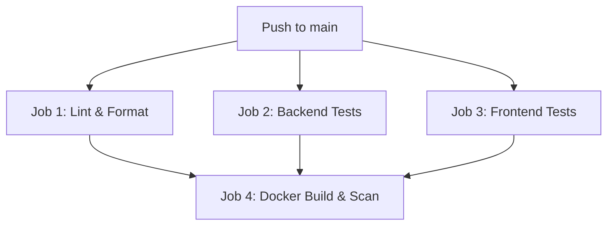

# CI/CD Pipeline

This document details the automated continuous integration and deployment pipeline configured for OmniSeek.

---

## 1. CI/CD Workflow Overview

The pipeline is implemented using GitHub Actions, defined in `.github/workflows/ci.yml`. It triggers automatically on every push or pull request to the `main` branch.

---

## 2. Pipeline Jobs & Stages

### A. Code Quality (Linting & Formatting)
*   **Tools**: Ruff, Black, isort, MyPy.
*   **Checks**: Enforces PEP 8 style formatting, imports sorting, strict type checking, and standard syntax rules.

### B. Backend Test Suite
*   **Environment**: Python 3.11 with `requirements.txt` dependencies.
*   **Testing**: Runs the Python test suite, generating test coverage reports via the coverage utility.
*   **Threshold**: Enforces a minimum of **90%** coverage.

### C. Frontend Test Suite
*   **Environment**: Node 20.
*   **Testing**: Installs package dependencies and executes the Jest component tests.

### D. Container Build & Security Scan
*   **Build**: Builds Docker images for the frontend and backend to verify Dockerfile validity.
*   **Scan**: Scans container images for security vulnerabilities before deployment.
