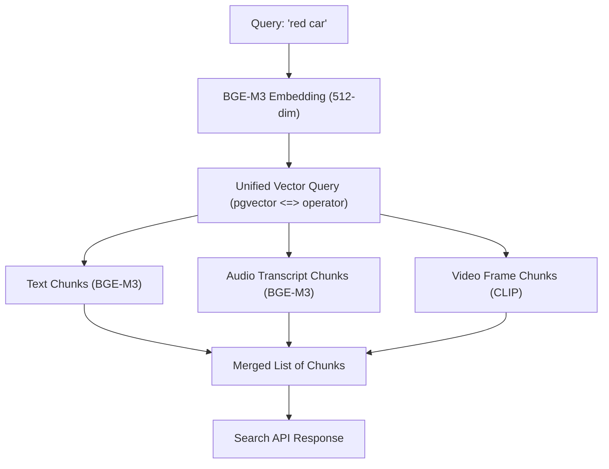

# Cross-Modal Search

This document explains the unified cross-modal search capabilities, showing how queries in one modality (text) retrieve content assets in multiple other modalities (audio transcriptions, video frames, text documents).

## Purpose

To support natural search queries over all media files (e.g. "person drinking milk" matching a video timestamp or a speech transcript segment) without requiring the user to specify which modality they want to search.

## Design & Embedding Strategy

All different modalities are represented in the same unified 512-dimensional vector space:

1. **Text Modality**:
    - Embedded with the BGE-M3 text transformer.
    - Sliced to 512-dim, L2 normalized.
2. **Audio Modality**:
    - Audio is transcribed to text segments via Faster-Whisper.
    - The resulting transcript text is embedded via BGE-M3.
    - Sliced to 512-dim, L2 normalized.
3. **Video Modality**:
    - Video contains two representations:
        - *Audio Track*: Transcribed via Faster-Whisper, text segments embedded via BGE-M3 (512-dim, normalized).
        - *Visual Frames*: Video frames are sliced and embedded via CLIP (ViT-B/32) visual encoder. CLIP vectors are natively 512-dimensional and L2 normalized.

Since both BGE-M3 (a text model) and CLIP (a text-to-image multi-modal model) are aligned, text query vectors can match visual frame embeddings (CLIP) and transcribed text embeddings (BGE-M3) in a unified retrieval process.

## Flow of Execution

## Tradeoffs

- **Model Space Alignment**: Although CLIP and BGE-M3 both generate 512-dimensional normalized vectors, they are trained on different data, so their embedding spaces might have different distributions. This can lead to different ranges of similarity scores (e.g. CLIP matches might score lower than BGE-M3 matches for the same semantic concept).
- **No Translation Model**: The unified space is shared, but we do not execute additional query translation layers, keeping the search extremely fast (< 500ms).

## Future Improvements

- **Embedding Space Normalization / Alignment**: Apply linear projection matrices (trained on small multi-modal datasets) to align CLIP visual embedding outputs more closely with BGE-M3 text space.
- **Cross-Attention Matching**: Implement a lightweight late-interaction layer (e.g., cross-attention) to compare fine-grained tokens and image patches.
