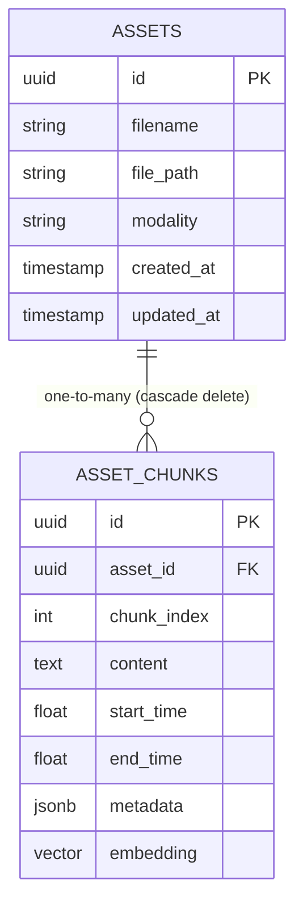

# Database Schema Reference

This document maps out the entity schemas, field constraint properties, and indexing configurations utilized within the OMNISEEK relational database layer.

---

## 1. Entity Definitions

### `assets` Table (Parent Entity)
Stores uploaded files and groups structural chunks.
*   `id` (UUID, Primary Key): Unique identifier.
*   `filename` (VARCHAR(255), Not Null): The original uploaded file name.
*   `file_path` (VARCHAR(512), Not Null): Local storage location.
*   `modality` (VARCHAR(50), Not Null): Enumerated type (`TEXT`, `AUDIO`, `VIDEO`).
*   `created_at` (TIMESTAMP, Default utcnow): Record creation timestamp.
*   `updated_at` (TIMESTAMP, Default utcnow): Record update timestamp.

### `asset_chunks` Table (Core Search Unit)
Stores segmented parts of parent assets representing semantic blocks.
*   `id` (UUID, Primary Key): Unique chunk ID.
*   `asset_id` (UUID, Foreign Key → `assets.id` ON DELETE CASCADE): References parent asset.
*   `chunk_index` (INTEGER, Not Null): Positional index sequence of the chunk.
*   `content` (TEXT, Not Null): Text transcript, captions, or extracted characters.
*   `start_time` (FLOAT, Nullable): Starting timestamp offset in seconds.
*   `end_time` (FLOAT, Nullable): Ending timestamp offset in seconds.
*   `metadata` (JSONB, Not Null): Rich dynamic metadata (such as speakers, frame references, length, etc.).
*   `embedding` (VECTOR(512), Nullable): 512-dimension vector embedding (inserted in Phase 4).

---

## 2. Table Relationship Constraints



---

## 3. High-Dimensional Indexing (HNSW)

The `embedding` column features a specialized HNSW index to optimize vector similarity query processing speed:
*   **Index Type**: HNSW (Hierarchical Navigable Small World)
*   **Operator Class**: `vector_cosine_ops` (Optimized for Cosine Similarity search)
*   **Command Definition**:
    ```sql
    CREATE INDEX idx_asset_chunks_embedding 
    ON asset_chunks 
    USING hnsw (embedding vector_cosine_ops);
    ```
