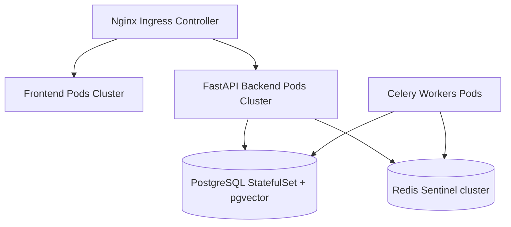

# Deployment Specification

This guide documents the procedures for deploying OmniSeek in production environments.

---

## 1. Environment Configurations

Production deployment requires defining configuration variables in a secure `.env` file:

```ini
# Production Setup
PROJECT_NAME=OMNISEEK
DEBUG=false
JWT_SECRET=supersecretjwtsigningkey2026

# Hosts & Ports
API_HOST=0.0.0.0
API_PORT=8000

# PostgreSQL Production Setup
DB_USER=omniseek_prod
DB_PASSWORD=securepassword
DB_NAME=omniseek
DB_PORT=5432
DB_URL=postgresql+asyncpg://omniseek_prod:securepassword@db:5432/omniseek

# Redis Production Setup
REDIS_URL=redis://redis:6379/0
```

---

## 2. Deployment Targets

### A. Docker Compose
Runs all services in a single multi-container setup:
```bash
docker compose -f docker-compose.yml up -d --build
```

### B. Linux VPS / AWS EC2 / GCP Compute Engine
1.  Install Docker and Docker Compose.
2.  Clone the repository and create a production `.env` file.
3.  Configure Nginx as a reverse proxy to route traffic from port 80/443 to the frontend (port 3000) and API (port 8000).
4.  Configure SSL certificates using Let's Encrypt / Certbot.

---

## 3. Kubernetes-Ready Topology

For high-scale orchestrations, the system can be deployed in a Kubernetes cluster:


*   **StatefulSets**: Used for PostgreSQL database nodes.
*   **Horizontal Pod Autoscaler (HPA)**: Auto-scales FastAPI backend and Celery worker pods based on CPU/Memory usage.
