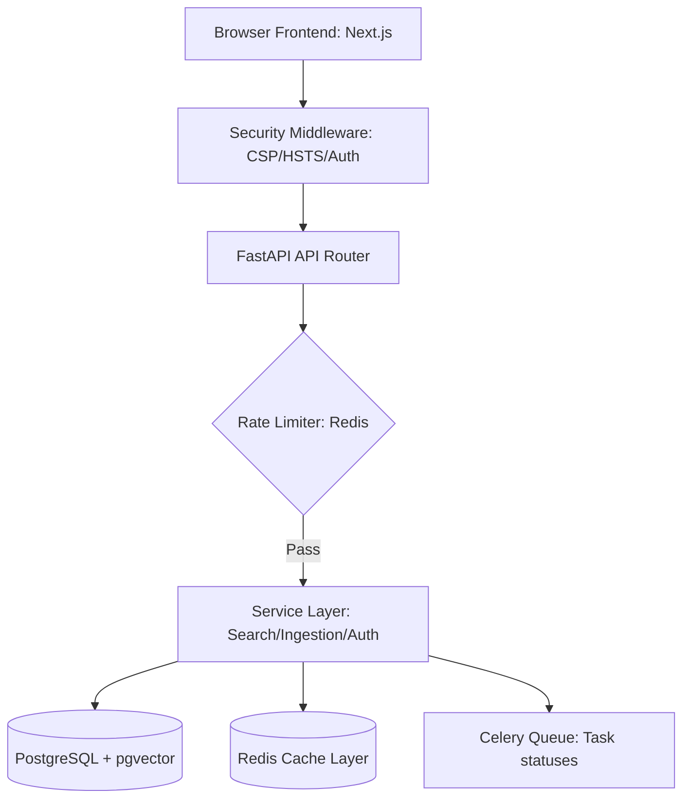

# Final System Architecture

This guide details the final production system architecture, security controls, and observability middleware layers implemented in OmniSeek.

---

## 1. System Topology

The final production topology isolates security and processing boundaries:

---

## 2. Decoupled Service Organization

The backend is built using a clean, decoupled architecture:

*   **API Layer** (`backend/api/`): Exposes REST endpoints, validates inputs, and enforces authorization and rate limits.
*   **Service Layer** (`backend/services/`): Orchestrates business logic, manages cache entries, and coordinates db transaction contexts.
*   **Model Layer** (`backend/models/`): Maps SQLAlchemy entities. Added `User` and `TaskStatus` to support security and tracking.
*   **Repository Layer** (`backend/repositories/`): Handles SQL queries, vector cosine similarities, and PostgreSQL Full-Text Search.
*   **Infrastructure Configuration** (`backend/core/`): Centralizes settings validation, logging configurations, and database connection pools.
