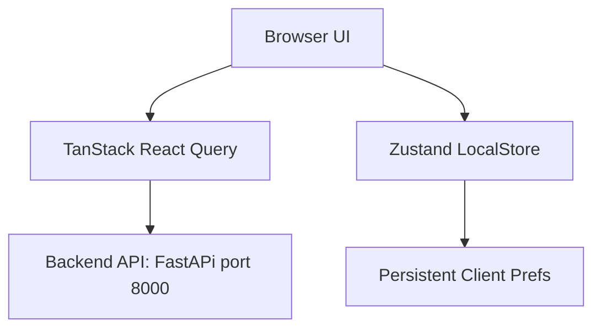

# Frontend Architecture Overview

This document details the architecture, design choices, and integration strategies utilized in the OmniSeek Next.js frontend application.

---

## 1. Application Design & Architecture

The application is built on top of **Next.js 14+** using the **App Router** framework. It leverages client-side rendering for interactive interfaces and standard server rendering for structural templates.

### Key Technologies:
*   **Next.js 14+ (App Router)**: Orchestrates page layout routing.
*   **TypeScript**: Ensures type-safe API schemas and component props.
*   **Tailwind CSS**: Utility class styling supporting fluid dark/light modes.
*   **TanStack React Query**: Manages query fetching, caching, mutation triggers, and polling.
*   **Zustand**: Handles simple global state persistence (search history, theme toggles, upload progress).

---

## 2. Directory Layout & Organization

The frontend codebase is located under `frontend/` and follows a structured schema:

*   `src/app/`: Core routing entrypoints (layout templates, dashboard metrics view, upload portal, search page, analytics graphs).
*   `src/components/`: Modular widgets and visual assets (sidebar, media players, explain panels).
*   `src/lib/`: API query fetch interfaces and data type schemas.
*   `src/store/`: Zustand persistent settings store definitions.
*   `src/tests/`: Unit test modules verifying state updates and page outputs.

---

## 3. Network Communication & Caching

The client connects to the FastAPI backend via `fetch` operations wrapped in React Query hooks. 

*   **Caching Strategy**: Search data queries are marked stale after 5 seconds to minimize backend pipeline loads.
*   **Ingestion Notifications**: Modifying queries invalidates metrics and analytics queries, auto-triggering dashboard telemetry updates.
*   **Polling Frequency**: The analytics dashboard queries poll every 10 seconds to display real-time latency logs and accuracy scores.
