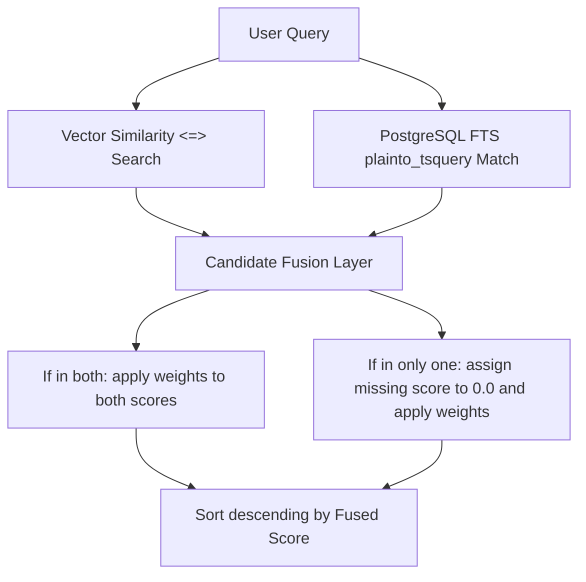

# Hybrid Search Integration

This document details the hybrid search architecture, PostgreSQL Full Text Search (FTS), and weighted fusion calculations.

## Purpose

Vector search can struggle with exact keyword matching (like part numbers, filenames, or specialized vocabulary). Hybrid search combines the semantic abstraction of vector retrieval with the exact match accuracy of lexical keyword search (FTS) to produce superior retrieval recall.

## Design

### 1. Lexical Keyword Match (PostgreSQL FTS)
We implement lexical matching using PostgreSQL's built-in text search capabilities. This avoids introducing external systems like Elasticsearch, minimizing resource usage and deployment complexity.
- **FTS Query Parser**: We use `plainto_tsquery` to split query strings into tokens joined by `AND` operators.
- **Score Ranking**: We use `ts_rank` on the `to_tsvector("english", content)` to score matching candidates based on term frequency and document length.
- **FTS Score Normalization**: `ts_rank` values are normalized to a strict `[0.0, 1.0]` range using a soft saturation curve:
  $$NormalizedFtsScore = \frac{rank}{rank + 1.0}$$

### 2. Weighted Score Fusion
We combine vector search scores (concept similarity) and FTS scores (keyword matching) using a linear weighted fusion:
$$FinalScore = (semantic\_score \times w_1) + (keyword\_score \times w_2)$$
Where $w_1$ (semantic weight) defaults to `0.7` and $w_2$ (keyword weight) defaults to `0.3` (weights are fully configurable).

## Flow of Execution

## Tradeoffs

- **Memory/Disk Space**: Built-in full-text indexes (`tsvector`) require minimal extra storage, keeping deployment simple and memory-efficient.
- **No Translation Layer**: Lexical keyword matching requires exact word overlap (stemmed by English rules). This is mitigated by our high semantic weight `0.7` which captures conceptual synonyms.

## Future Improvements

- **BM25 Search**: Implement a BM25 scoring function using custom Postgres procedures to replace standard `ts_rank` for better lexical scores.
- **Reciprocal Rank Fusion (RRF)**: Implement RRF to combine ranks rather than scores, removing the need to align and normalize score ranges.
