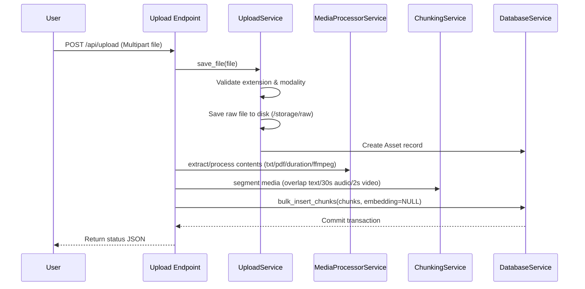

# Media Ingestion Pipeline

This document describes the step-by-step ingestion flow designed for processing multi-modal text, audio, and video media file uploads.

---

## 1. Pipeline Execution Workflow

The ingestion pipeline runs synchronously within a single transaction scope for validation consistency:

---

## 2. Granular Step Details

1.  **File Format Validation**: The system checks extensions. Unsupported file extensions trigger a `ValidationError` (400) immediately before files are written.
2.  **Storage Isolation**: Files are stored under a path mapped to a unique UUID: `/storage/assets/{asset_id}/`. Subdirectories `raw/`, `frames/`, `audio/`, and `processed/` are initialized.
3.  **Modality Demuxing**:
    *   *TEXT*: Extracted via plain-text read or parsed page-by-page using `pypdf`.
    *   *AUDIO*: Probed using `ffprobe` to capture precise durations.
    *   *VIDEO*: Probed for duration, demuxed using `ffmpeg` to extract a separate MP3 audio track, and sliced into frames every 2 seconds.
4.  **Temporal Chunking**: Chunks are assembled with sliding character overlaps (text), 30-second slots (audio), or 2-second segments enriched with frame metadata (video).
5.  **Bulk database mapping**: All generated chunks are inserted in a single transactional query batch to minimize network roundtrips. Chunks maintain `embedding = NULL`.
