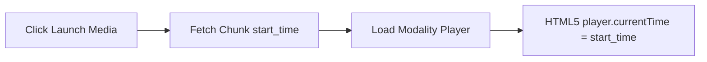

# Temporal Media Playback & Viewer

This document details the components and seeking mechanics utilized in temporal search retrieval.

---

## 1. Playback Architecture & Seeking Flow

OmniSeek maps vector matches directly to offset timelines:



---

## 2. Playback Sub-components

### A. VideoPlayer & AudioPlayer
*   Uses native HTML5 `<video>` and `<audio>` structures.
*   Resolves file URLs to local storage endpoints: `/storage/assets/{asset_id}/raw/{filename}`.
*   Binds programmatic React `useRef` hooks to control components, setting `currentTime = start_time` on load.

### B. DocumentViewer
*   Renders document files (TXT, PDF string chunks).
*   Highlights matched snippets using a markup helper:
    ```typescript
    const index = fullText.toLowerCase().indexOf(searchPhrase.toLowerCase());
    ```
    Splits text segments and wraps matching phrases in `<mark>` tags to draw user attention.
