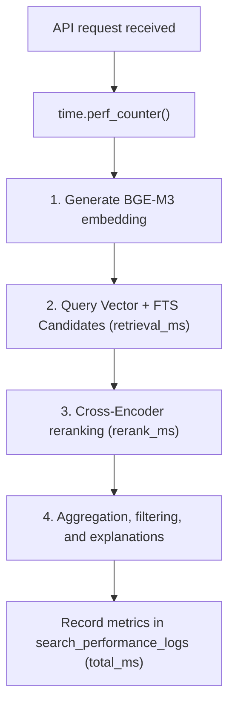

# Latency Monitoring and Telemetry

This document details the search latency monitoring table schema, sub-component execution tracking, and performance logging flows.

## Purpose

To track performance metrics, identify bottleneck stages (e.g. slow embedding generation, long database vector queries, or slow reranking inference), and monitor overall system health under varying loads.

## Database Schema Design

Performance telemetry is saved to the `search_performance_logs` table, mapped via the `SearchPerformanceLog` SQLAlchemy model:

```sql
CREATE TABLE search_performance_logs (
    id UUID PRIMARY KEY,
    query TEXT NOT NULL,
    retrieval_ms FLOAT NOT NULL,
    rerank_ms FLOAT NOT NULL,
    total_ms FLOAT NOT NULL,
    created_at TIMESTAMP WITHOUT TIME ZONE DEFAULT timezone('utc'::text, now())
);
```

- **id**: Unique UUID identifier.
- **query**: Raw query string input.
- **retrieval_ms**: Time elapsed running vector query and full-text keyword matching (in milliseconds).
- **rerank_ms**: Time elapsed running Cross-Encoder prediction batching (in milliseconds).
- **total_ms**: Total elapsed request time from API parsing to final results output (in milliseconds).
- **created_at**: High-precision UTC timestamp.

## Flow of Execution



If database logging fails, exceptions are caught and logged locally to prevent disrupting search results.

## Tradeoffs

- **Synchronous Write Overhead**: Committing logs to PostgreSQL inside the active session adds a minor write overhead (~2-5ms). This is acceptable for our performance goals and ensures database consistency.

## Future Improvements

- **Asynchronous Telemetry Worker**: Send performance logs to a Redis queue and let Celery tasks write them to the DB asynchronously to minimize API latency.
- **Grafana/Prometheus Integration**: Expose an `/metrics` endpoint to export latency metrics directly to Prometheus for real-time dashboards.
