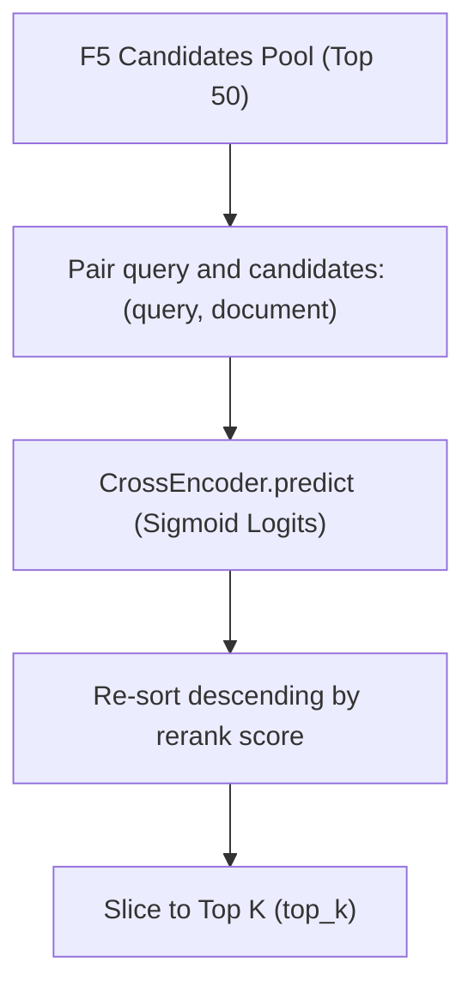

# Cross-Encoder Reranking

This document details the cross-encoder reranking integration, model configurations, batch execution logic, and CPU execution details.

## Purpose

While vector searches (using bi-encoders like BGE-M3) are extremely fast and enable candidate filtering over large datasets, they encode sentences into independent embeddings, missing token-to-token interactions. 
Rerankers (using cross-encoders) process the query and document *together* in a joint attention layer, capturing fine-grained contextual overlap and reducing false positives.

## Design

### 1. Model Configuration
We utilize `BAAI/bge-reranker-base` loaded programmatically on CPU via the `AIModelManager` singleton. 
- **Parameter count**: 270M parameters.
- **Latency target**: Reranking 50 candidates on CPU takes ~200-400ms, which fits within the 1500ms Accurate Mode budget.

### 2. Implementation Flow

### 3. Logits Sigmoid Activation
BGE-reranker outputs raw similarity logits. We apply a sigmoid activation function to map these logits to a normalized `[0.0, 1.0]` range:
$$Score = \frac{1}{1 + e^{-logit}}$$

## Tradeoffs

- **Computational Latency**: Running cross-encoder inference on CPU is CPU-heavy. To prevent execution timeouts, we run reranking *only* in "Accurate Mode" and restrict the candidate reranking pool to the top 50 matches.
- **Batching**: We use a batch size of 32 for predictions to maximize CPU cache utilization and minimize thread scheduling overhead.

## Future Improvements

- **GPU Inference**: Support running predictions on CUDA device context when GPUs are available.
- **Sequence Truncation**: Truncate long candidate chunks to 256 tokens before cross-encoder predictions to reduce calculation times.
