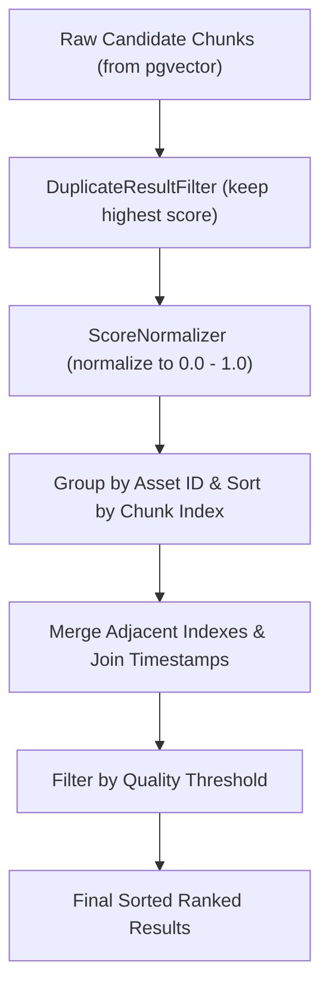

# Result Aggregation and Deduplication

This document explains the result aggregation, duplicate filtering, and score normalization logic implemented in the search engine.

## Purpose

1. **Duplicate Reduction**: Prevents identical chunks or redundant overlaps from showing up multiple times.
2. **Temporal Aggregation**: Groups sequential, adjacent media segments from the same asset into a single, cohesive result block with merged timestamps and content, mimicking natural playback intervals.
3. **Score Normalization**: Maps raw cosine values (`[-1.0, 1.0]`) to a strict, human-friendly confidence score scale of `[0.0, 1.0]`.

## Design

### 1. DuplicateResultFilter
Iterates over all candidate chunks and keeps only the highest-scoring occurrence of any unique `chunk_id`.

### 2. ResultAggregator
Groups chunks by their parent `asset_id` and sorts them by `chunk_index`.
For sequential indices (where `chunk_index_b - chunk_index_a <= 1`):
- Concatenates text contents: `content_a + " " + content_b`.
- Expands start and end boundaries: `start_time = min(start_time_a, start_time_b)` and `end_time = max(end_time_a, end_time_b)`.
- Retains the maximum similarity score: `score = max(score_a, score_b)`.
- Filters out any merged entries that fall below `quality_threshold`.

### 3. ScoreNormalizer
Standardizes raw cosine similarity score `s` as:
$$NormalizedScore = \max\left(0.0, \min\left(1.0, \frac{s + 1.0}{2.0}\right)\right)$$

## Tradeoffs

- **Concatenation Size**: Merging multiple adjacent chunks creates a larger text block, which is excellent for video/audio playbacks but might result in longer snippets in the search response.
- **Score Dilution**: Keeping the maximum score of merged chunks is optimistic, representing the strongest match within that continuous media segment.

## Future Improvements

- **Adaptive Aggregation Gaps**: Allow merging chunks that have small index gaps (e.g. index 3 and index 5 if they are within a 5-second interval) to handle noise.
- **Dynamic Thresholding**: Adjust quality thresholds dynamically based on query length and result distributions.
