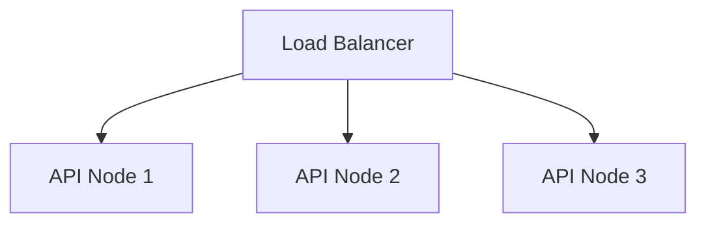

# Scalability Design

This guide details the scaling strategies for expanding OmniSeek to handle production loads.

---

## 1. API & Web Service Scaling

### Horizontal Scaling
*   The FastAPI backend is stateless, allowing it to scale horizontally.
*   Multiple instances can run behind a load balancer (such as Nginx, AWS ALB, or Traefik) using standard round-robin or least-connections routing algorithms.

---

## 2. Ingestion & Worker Scaling

### Distributed Task Processing
*   Celery processes tasks independently, allowing workers to scale horizontally.
*   Heavy embedding tasks can be routed to dedicated worker pools equipped with GPUs (for Whisper transcriptions and CLIP visual feature extractions).

---

## 3. Database & Vector Search Scaling

### A. PostgreSQL Scaling
*   **Read Replicas**: Standard read operations (such as loading recent uploads or checking logs) can be routed to database read replicas to reduce load on the primary writer node.
*   **Write Sharding**: Database writes can be partitioned by `asset_id` ranges.

### B. pgvector Index Optimization
*   As vectors grow, search performance can degrade. High-efficiency retrieval is maintained by:
    *   Tuning the HNSW index (`m` and `ef_construction` parameters).
    *   Adding dedicated pgvector replicas to handle vector query loads.
    *   Using PGPool-II for connection pooling.
