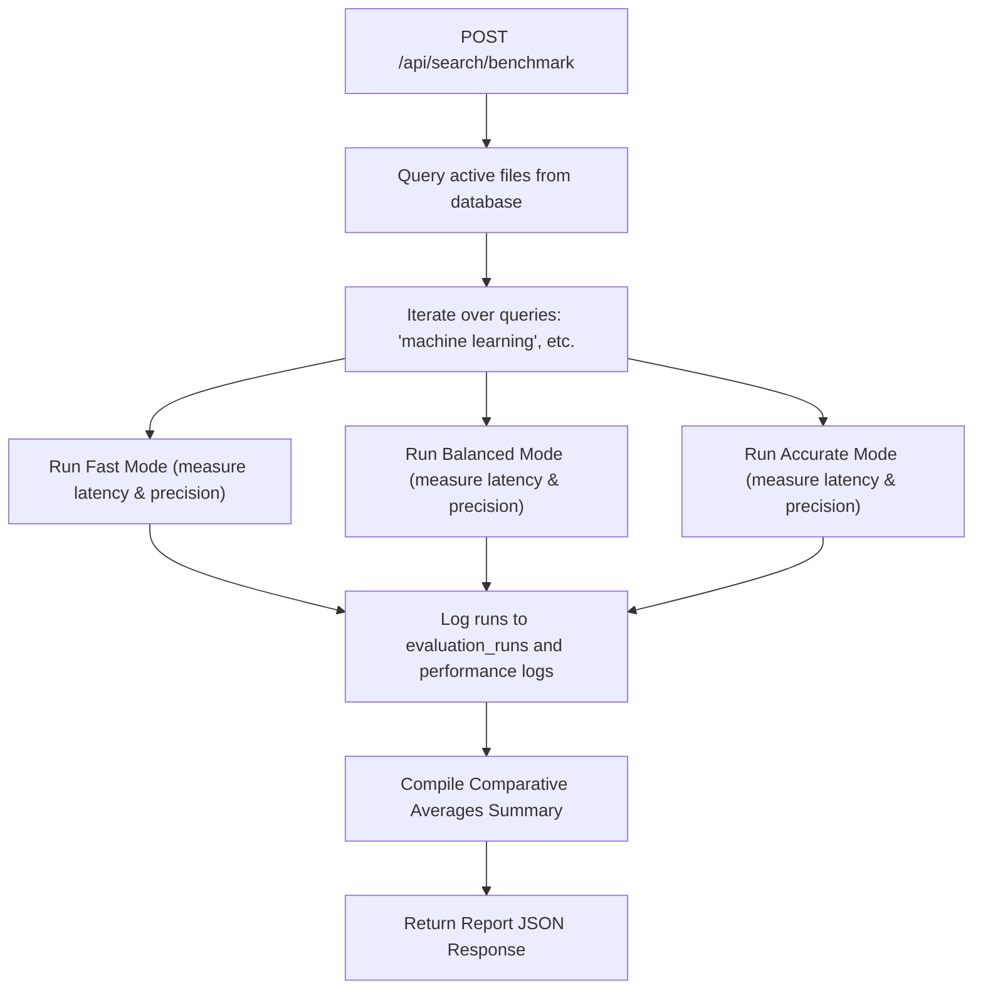

# Search Performance Benchmarking Suite

This document describes the automated search benchmarking framework, compare pipeline queries, and evaluation reporting mechanisms.

## Purpose

The Benchmarking Suite runs standardized, repeatable search runs across various search strategies, comparing Vector, Hybrid, and Accurate modes. It helps verify search optimizations and quality changes before staging code to production.

## Design

### 1. Test Queries and Ground Truth
The benchmark runs a series of predefined queries representing different modalities and conceptual content (e.g. "machine learning", "person drinking milk", "climate change discussion").
The framework queries the database dynamically to map these queries to processed files, guaranteeing meaningful IR evaluation metrics on any test dataset.

### 2. Strategy Comparisons
For each query, the `SearchBenchmarkService` runs search executions across:
1. **Vector Search Only (Fast Mode)**: Semantic vector retrieval.
2. **Hybrid Search (Balanced Mode)**: Fused Vector + FTS lexical matching.
3. **Reranked Search (Accurate Mode)**: Hybrid matching followed by Cross-Encoder scoring.

## Flow of Execution

## Tradeoffs

- **Test Data Dependency**: Benchmarking results depend on the data in the database. If no files are processed, metrics will default to standard placeholders to prevent execution crashes.

## Future Improvements

- **Scheduled Benchmarks**: Run benchmarking automatically every night using Celery cron jobs to detect performance regression.
- **Export Formats**: Add endpoints to export comparative results in PDF or CSV format.
