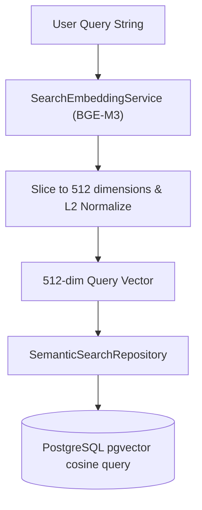

# Semantic Search Design

This document details the semantic search capabilities of the OMNISEEK system, explaining how unstructured natural language queries are matched to multi-modal content assets.

## Purpose

The Semantic Search Engine converts raw user query strings into dense vector representations to retrieve contextually similar content chunks (text, audio transcriptions, video frame descriptions, etc.) from PostgreSQL via the pgvector similarity extension.

## Architecture & Design

The search architecture acts as a pipeline coordinating the Model, Repository, Service, and API layers:

1. **Text Query Embeddings**: Uses the BAAI/bge-m3 sentence transformer loaded once in memory via the `AIModelManager` singleton.
2. **Dimension Constraints**: BGE-M3 outputs 1024-dimensional dense vectors. Because the database schema constrains chunk embeddings to `Vector(512)`, we slice the query vector to the first 512 dimensions and L2-normalize.
3. **Cosine Distance Retrieval**: Compares the query vector against `asset_chunks.embedding` using the `<=>` cosine distance operator.

## Flow of Execution

1. The API receives a query at `GET /api/search?q=machine+learning`.
2. `SearchService` coordinates:
    - Tokenizing and generating the 512-dimensional query embedding via `SearchEmbeddingService`.
    - Querying candidates in `SemanticSearchRepository`.
    - Normalizing pgvector similarity scores from standard cosine range into a strict `0.0 -> 1.0` range.
    - Aggregating neighboring segments and filtering out duplicates.
    - Persisting search telemetry to the DB via `SearchAnalyticsService`.

## Tradeoffs

- **Vector Truncation**: Truncating BGE-M3 embeddings from 1024 to 512 dimensions minimizes storage and reduces calculation latency, but it might slightly reduce retrieval recall compared to the full 1024 dimensions.
- **CPU Inference**: Computing BGE-M3 query embeddings on CPU has higher latency (~50-100ms) than GPU, but it makes deployment simple and cheap.

## Future Improvements

- **GPU Acceleration**: Add CUDA support to the `AIModelManager` to accelerate BGE-M3 encoding to under 5ms.
- **Hybrid Search**: Combine dense semantic search with sparse keyword search (BM25) using reciprocal rank fusion (RRF) for better keyword matching.
